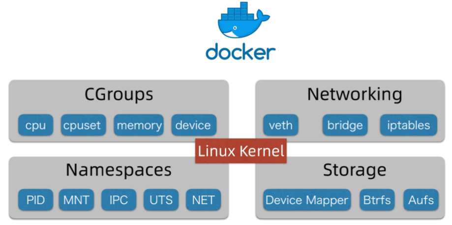

# OJ

尽量每天更新 & 一端时间的学习后解决前一段时间留下来的问题——沉淀/doge  
新增需求：一键变灰？  
哈哈哈哈哈哈，地狱需求/doge

其实，做到现在，发现前端——主要实现各种各样的功能；后端——实现和数据库交互的操作（目前来看是这样的）  
毕竟后端的 api接口 & 数据库的myBatis 可以直接生成  
而前端的各种功能也是很多都需要接入第三方的组件来实现，如何把这些组件和前端接到一起就是一个问题了（接入易、调通不易！）

tabnine真他娘的好用啊 我日！！！！！！！！！

**前端模板 去拉day2的代码**

### 系统功能梳理

1. 用户模块
    1. 注册
    2. 登录
2. 题目模块
    1. 创建题目-admin
    2. 删除题目-admin
    3. 修改题目-admin
    4. 搜索题目-user
    5. 在线做题——题目详情页
3. 判题模块
    1. 提交判题——结果正确or错误
    2. 错误处理——内存溢出、安全性、超时
    3. **代码沙箱**——安全沙箱
    4. 开放接口

### 项目技术：

* 前端：
  > Vue3、Arco Design 组件库、手撸项目模板 (✔)  
  > 在线代码编辑器、在线文档编辑 (✔)
* 后端：
  > Java 进程控制
  > Java安全管理器
  > 部分JVM知识点
* 服务器：
  > 虚拟机 (云服务器)
  > Docker (代码沙箱实现)  
  > Spring Cloud 微服务、消息队列、多种设计模式

## Day1 2023.9.11

一些小概念：

1. 任务调度：不是直接拒绝，应该是告诉用户要等多久轮到自己执行
2. 要学会制作时序图、分层架构图
3. 代码沙箱：让程序跑在一个隔离的环境下，不对外界的其他程序造成影响（保证每个用户的程序运行在独立的环境中）——coding的过程中可以先把它当成黑盒...

框架的结构(src部分)：

1. **assets 文件夹**：这通常用于**存放项目中的静态资源**，如图像、字体、样式表、音频文件等。这些资源可以在前端应用程序中使用，并通过相对路径引用
2. **components 文件夹**：这是用于**存放可重用组件**的地方。组件是前端应用程序的构建块，它们可以包括界面元素、小部件和功能模块。将组件放在这个文件夹中有助于保持代码的组织结构和可维护性。
3. **layouts 文件夹**：这个文件夹通常用于**存放应用程序的不同布局或页面模板**。在一些前端框架中，你可以创建多个不同的布局，然后根据需要将它们应用于不同的页面。
4. **router 文件夹**：在使用前端路由器的应用程序中，这个文件夹通常**包含路由配置和路由器相关的代码**
   。前端路由器用于管理应用程序的导航和URL路由。
5. **store 文件夹**：如果你使用状态管理库（如Vuex、Redux等），这个文件夹通常用于**存放应用程序的状态管理代码**
   。状态管理库有助于管理应用程序的全局状态和数据。
6. **views 文件夹**：这个文件夹通常**包含应用程序的不同视图或页面**。**每个视图对应着一个特定的路由或页面**
   ，它们通常包含与用户界面相关的代码和逻辑。
7. **access 文件夹**：全局权限校验

### 前端初始化：

1. 正常的node环境 & vue-cli脚手架
2. vue create yhyoj_frontend——创建自己的前端项目

#### 组件库：

yarn add --dev @arco-design/web-vue——引入组件库arco design(使用非常方便)

```ts
import {createApp} from 'vue'
import ArcoVue from '@arco-design/web-vue';
import App from './App.vue';
import '@arco-design/web-vue/dist/arco.css';

const app = createApp(App);
app.use(ArcoVue);
app.mount('#app');
//完整引入（写进main.ts）
```

### 项目通用布局：(于layouts文件夹中)

详见layouts/BasicLayout.vue，下面是学到的东西

###### 无code的部分：

1. 每个组件要给出一个id（coding习惯）
2. 比较大块的内容，用div框起来
3. 布局需要先把上中下的内容安排好，然后再写内容

###### 含code的部分：

1. ```vue
    <style scoped></style> 
   <!--这个样式将仅适用于包含该<style>标签的元素及其子元素，而不会影响到全局的样式。-->
    ```
2. ```js
    const router = useRouter();
    const selectedKeys = ref([route.path]);
    
    router.afterEach((to, from, failure) => {
        selectedKeys.value = [to.path];
        <!--表示跳转路由后，执行函数中的内容-->
    });
   <!--执行路由后，同步更新菜单栏的高亮状态-->
   <!--整体的执行：点击菜单栏 => 跳转并更新路由 => 更新路由后，同步更新菜单栏的高亮状态-->
    ```

#### 动态路由配置方法：

1. 提取通用路由文件，将得到的新文件import进index.ts中
2. 菜单组件读取路由，动态渲染菜单项
3. 绑定跳转事件
4. 同步路由到菜单项

#### 全局状态管理：

所有页面全局共享的变量，而不是仅仅局限于某一个页面中
一般为User & LoginUser

state: 存储的状态信息，比如用户信息  
mutation (尽量同步) : 定义了对变量进行增删改 (更新) 的方法  
actions (支持异步): 执行异步操作，并且触发 mutation 的更改 (actions 调用 mutation)  
modules (模块): 把 个大的 state (全局变量) 划分为多个小模块，比如 user 专门存用户的状态信息

#### 权限管理:

能够直接以一套通用的机制,去定义哪个页面需要哪些权限  
(路由中定义页面所需要的权限)

1. 在路由配置文件，定义某个路由的访问权限
2. 在全局页面组件 app.vue 中，绑定一个全局路由监听。每次访问页面时，根据用户要访问页面的路由信息先判断用户是否有对应的访问权限
3. 如果有，跳转到原页面，如果没有，拦截或跳转到 401 鉴权或登录页  
   下面是一个利用beforeEach获取路由信息,进而判断的方法

```js
router.beforeEach((to, from, next) => {
    if (to.meta?.access === "canAdmin") {
        if (store.state.user.loginUser?.role !== "admin") {
            next("/noAuth");
            return;
        }
    }
    next();
});
```

## Day2 2023.9.12

### question:

1. min-height是什么？vh是什么意思？| position是什么元素？
2. :wrap是换行？怎么记忆
3. style="margin-bottom: 16px" 这是什么意思呢？
4. v-for 和 v-if的渲染优先级问题，**v-for 比 v-if 有更高的优先级**  
   意味着在同一元素上使用 v-for 和 v-if 时，v-for 的循环渲染会在 v-if 条件判断之前执行。  
   **所以尽量不要两者一起使用（推荐在js中先过滤）**
5. const loginUser = store.state.user.loginUser; 这是什么意思呢？

### 项目通用布局（接上）

#### 全局权限管理（new），不再依赖于app.vue，根据权限控制菜单的显隐

新建一个access目录用于定义权限

1. 定义权限，见accessEnum.ts（可知类似枚举类，进而确定权限定义的规范）
   ```js
      const AccessEnum = {
         NOT_LOGIN: "notLogin",
         USER: "user",
         ADMIN: "admin",
       };
   ```
2. 定义一个公用的权限校验函数，见checkAccess.ts
   ```js
   const checkAccess = (loginUser: any, needAccess = AccessEnum.NOT_LOGIN) => {
   //获取当前登录用户具有的权限，如果没有loginUser，默认未登录
    const loginUserAccess = loginUser?.userRole ?? AccessEnum.NOT_LOGIN;
    if (needAccess === AccessEnum.NOT_LOGIN) {
        return true;
    }
   //如果需要用户登录才能访问
    if (needAccess === AccessEnum.USER) {
   // 只要登录就可以了
        if (loginUserAccess === AccessEnum.NOT_LOGIN) 
            return false;
    }
    if (needAccess === AccessEnum.ADMIN) {
        if (loginUserAccess !== AccessEnum.ADMIN)
            return false;
    }
    return true;
   //影响不大，属于少写代码了
   };
   ```
3. 修改GlobalHeader，特别是使用了计算属性，可以保证在更新的时候，会同步更新对页面的渲染
   ```ts
      const visibleRoutes = computed(() => {
        return routes.filter((item, idex) => {
            if (item.meta?.hideInMenu) {
                return false;
            }
            if (
                !checkAccess(store.state.user.loginUser, item?.meta?.access as string)
            ) {
                return false;
            }
            return true;
        });
      });
   ```
4. **特殊提醒：一个js文件想要被其他模块使用，需要导出**，如下
   ```js
   export default checkAccess;
   export default AccessEnum;
   ```

### 全局项目入口（但是没有实现）

app.vue中，见doInit & onMounted

## 前端初始化到此为止！下面是后端!!!!!!!!!!!!!!!!!(SO 前端模板 拉day2的代码)

后端主要用的是 《后端模板》，详见本人 springboot-init项目

### 使用方法：

1. 改项目名称  
   ctrl + shift + F 进行全局搜索，找到springboot-init  
   ctrl + shift + R 进行全局替换，换为自己的项目名称（本项目后端为yhyoj_backend）
2. 改包名  
   ctrl + shift + F 进行全局搜索，找到包名（springbootinit）  
   ctrl + shift + R 进行全局替换，换为自己的包名（本项目后端为yhyoj）
3. 找到未替换的包名（一般为目录名）  
   shift + F6 ， 将包名替换为上一步的包名
4. 并且按照定义设计数据库(可以直接执行sql/create_table.sql，改名即可)
5. 找到 yhyoj_backend(项目名称)/src/main/resources/application.yml 修改配置文件  
   数据库部分，按照自己的本地数据库进行更改，替换之前的my_db  
   端口号，尽量不要和自己的其他项目的重复
6. **启动！！！！一定要启动main中的MainApplication文件**
   血泪史，没看清，自己瞎搞了半天，发现是启动错文件了，淦！！！！！
7. 接下来启动http://localhost:8121(定义的端口号)/api/doc.html
   http://localhost:8121(定义的端口号)/api/v2/api-docs，后端接口的参数之类的东西

8. 日志部分没有完善哦~

## Day3 2023.9.13

### question:

1. aop切面？ 有什么用呢
2. ```ts
    commit("updateUser", {
        ...state.loginUser,
        userRole: AccessEnum.NOT_LOGIN,
    });
    ```
   这里的...是什么意思？
3. await store.dispatch("user/getLoginUser");  
   await 是干嘛的
4. next(`/user/login?redirect=${to.fullPath}`);
   这里跳转后重定向，是什么意思 & 语法

### 后端模板讲解：

1. 先阅读 README.md
2. sql/create_table.sql 定义了数据库的初始化建库建表语句
3. sql/post_es_mapping.json 帖子表在 ES 中的建表语句
4. aop：用于全局权限校验、全局日志记录
5. common：万用的类，比如通用响应类
6. config：用于接收 application.yml 中的参数，初始化一些客户端的配置类（比如对象存储客户端）
7. constant：定义常量
8. controller：接受请求
9. esdao：类似 mybatis 的 mapper，用于操作 ES
10. exception：异常处理相关
11. job：任务相关（定时任务、单次任务）
12. manager：服务层（一般是定义一些公用的服务、对接第三方 API 等）
13. mapper：mybatis 的数据访问层，用于操作数据库
14. model：数据模型、实体类、包装类、枚举值
15. service：服务层，用于编写业务逻辑
16. utils：工具类，各种各样公用的方法
17. wxmp：公众号相关的包
18. test：单元测试
19. MainApplication：项目启动入口
20. Dockerfile：用于构建 Docker 镜像

### 前后端联调：( 接口！)

前端发送请求，调用后端接口；接口/请求，连接前后端

现在！使用**openAPI**自动生成！如下：

```
npm install openapi-typescript-codegen --save-dev
openapi --input http://localhost:8121/api/v2/api-docs --output ./generated --client axios
```

就获得了接口的文件（在前端获取），不用再自己一点点写啦！（如果有更新就再运行上面的指令就行了）

(如果无法运行，请进行全局安装openapi，```npm install -g openapi-typescript-codegen```)

**如果想要自定义参数**

1. 修改generated/core/OpenAPI.ts文件中，对应的参数
    ```ts
    export const OpenAPI: OpenAPIConfig = {
        BASE: 'http://localhost:3000/api',
        VERSION: '2.0',
        WITH_CREDENTIALS: false,
        CREDENTIALS: 'include',
        TOKEN: undefined,
        USERNAME: undefined,
        PASSWORD: undefined,
        HEADERS: undefined,
        ENCODE_PATH: undefined,
    };
   ```
2. 直接定义axios 请求库的全局参数，如全局请求响应拦截器
    ```ts
    //new 了一个yhyoj_frontend/src/plugins/axios.ts
    // Add a request interceptor
    import axios from "axios";
    
    axios.interceptors.request.use(
        function (config) {
        // Do something before request is sent
            return config;
        },
        function (error) {
        // Do something with request error
            return Promise.reject(error);
        }
    );
    
    // Add a response interceptor
    axios.interceptors.response.use(
        function (response) {
            console.log("响应", response);
            // Any status code that lie within the range of 2xx cause this function to trigger
            // Do something with response data
            return response;
        },
        function (error) {
            // Any status codes that falls outside the range of 2xx cause this function to trigger
            // Do something with response error
            return Promise.reject(error);
        }
    );
    ```
   并且在mian.js中配置axios.ts文件```import "@/plugins/axios";```

## 后端初始化到此为止！下面是主要业务的实现

简单的增删改查就在store/user.ts中实现，全局状态管理是有它的用途滴

### 用户登录功能

1. 自动登录
    * 编写获取远程登录用户信息的代码
      ```ts
      actions: {
         async getLoginUser({ commit, state }, payload) {
            //从远程获取登录信息
            const res = await UserControllerService.getLoginUserUsingGet();
            if (res.code === 0) {
               commit("updateUser", res.data);
            } else {
               commit("updateUser", {
                  ...state.loginUser,
                  userRole: AccessEnum.NOT_LOGIN,
               });
            }
            // 触发了mutation的更改
         },
      },
      ```
    * 在哪里触发 getLoginUser 的执行？应当在一个全局的位置  
      路由拦截(✔，之前在app.vue中有写过，现在移到access/index.ts中) 、全局页面入口app.vue、全局通用布局、

#### 全局权限管理优化

1. 新建 access\index.ts 文件，把原有的路由拦截、权限校验逻辑放在独立的文件中  
   优势：只要不引入、就不会开启、不会对项目有影响
2. 编写权限管理和自动登录逻辑  
   如果没登陆过，自动登录：
   ```ts
   // // 如果之前没登陆过，自动登录
   if (!loginUser || !loginUser.userRole) {
   // 加 await 是为了等用户登录成功之后，再执行后续的代码
        await store.dispatch("user/getLoginUser");
   }
   ```
3. 最终函数
   ```ts
   router.beforeEach(async (to, from, next) => {
      console.log("登陆用户信息", store.state.user.loginUser);
      const loginUser = store.state.user.loginUser;
      //如果之前没登陆过，自动登录
      if (!loginUser || !loginUser.userRole) {
         // 加 await 是为了等用户登录成功之后，再执行后续的代码，异步变同步
         await store.dispatch("user/getLoginUser");
      }
      //上面是希望用户尽量登录，
      //因为可能存在依旧没有登录的情况，所以需要下面的判断。。。非常的严
      const needAccess = (to.meta?.access as string) ?? ACCESS_ENUM.NOT_LOGIN;
      // 要跳转的页面必需要登陆
      if (needAccess !== ACCESS_ENUM.NOT_LOGIN) {
         // 如果没登陆，跳转到登录页面
         if (!loginUser || !loginUser.userRole) {
            next(`/user/login?redirect=${to.fullPath}`);
            return;
         }
         // 如果已经登陆了，但是权限不足，那么跳转到无权限页面
         if (!checkAccess(loginUser, needAccess)) {
            next("/noAuth");
            return;
         }
      }
      next();
   });
   
   ```

#### User页面开发：

包括登录和注册
因为登录页面不需要通用模板的导航栏，所以就自己再开发一套喽，实现多套布局

##### 实现多套布局：

在route.ts中，添加user的对应路由

   ```ts
   {
    path: "/user",
        name
:
    "用户",
        component
:
    UserLayout,
        children
:
    [
        {
            path: "/user/login",
            name: "用户登录",
            component: UserLoginView,
        },
        {
            path: "/user/register",
            name: "用户注册",
            component: UserRegisterView,
        },
    ],
        meta
:
    {
        hideInMenu: true,
    }
,
}
,
   ```

在app.vue中将UserLayout 和BasicLayout 做出区分

## Day4 2023.9.14

沉淀，解决之前的问题

##### copy from Day2

1. min-height是什么？vh是什么意思？| position是什么元素？
   > min-height是一种CSS属性，用于指定元素的最小高度，   
   > vh是CSS 中的一个单位，代表视口高度（Viewport Height）；一般有 min-height = 100vh
   表示元素的高度就是浏览器窗口的可见高度  
   > position 是CSS属性。它用于定义HTML元素在页面上的定位方式；position: sticky表示将当前元素黏附到特定位置上
2. :wrap是换行？怎么记忆
   > 记住吧，参数：true——启用文本或内容的自动换行；false——禁用文本或内容的自动换行
3. style="margin-bottom: 16px" 这是什么意思呢？
   > 定义该元素的底部边距（margin）为16像素；其实不只是页面底部，包括当前元素与下一个元素之间的边距
4. v-for 和 v-if的渲染优先级问题
   > **v-for 比 v-if 有更高的优先级**  
   意味着在同一元素上使用 v-for 和 v-if 时，v-for 的循环渲染会在 v-if 条件判断之前执行。  
   **所以尽量不要两者一起使用（推荐在js中先过滤）**
5. const loginUser = store.state.user.loginUser; 这是什么意思呢？
   > 前面肯定有const store = useStore();
   > 这个就像数据结构一样，一层一层的 state

##### copy from Day3

1. aop切面？ 有什么用呢
   > 在后端
   aop：用于全局权限校验、全局日志记录
2. ```ts
    commit("updateUser", {
        ...state.loginUser,
        userRole: AccessEnum.NOT_LOGIN,
    });
    ```
   这里的...是什么意思？
   > 经过查资料 ...是保证单向的数据传递，确保状态的不可变性和可预测性。。。。。
   > 其实就是获取之前这个参数的值
3. await store.dispatch("user/getLoginUser");  
   await 是干嘛的——异步变同步
   > await 关键字用于等待一个异步操作的完成，使异步代码看起来像同步代码一样执行。  
   > 表示等待 store.dispatch("user/getLoginUser") 这个异步操作完成后再继续执行下面的代码，从而实现了异步变同步的效果。
4. next(`/user/login?redirect=${to.fullPath}`);
   这里跳转后重定向，&是什么意思
   > 就是之前mybatis中的参数空缺，使用to.fullPath填充

##### create from codeFiles

1. 关于 store.dispatch 的作用：
   > dispatch：分发；之后跟一个方法如user/getLoginUser & 传递的参数  
   > 实现调用store中actions部分中的函数  
   > 实现了异步操作
2. 一定要注意store中的状态变量，调用方法：  
   store.state.user（某个store文件存储的状态）.某个状态  
   使用store.dispatch 调用actions 中的函数  
   使用store.commit 调用 mutations 中的函数

## Day5 2023.9.15

关于router.push的参数 replace的认识

```ts
await router.push({
    path: "/user/login",
    replace: true,
});
```

replace 表示用于导航时控制路由的替代方式（默认为false）  
当设置为true时，它将替代当前路由历史中的当前路由，而不会在历史中创建新的路由记录。  
这意味着用户在浏览器的后退按钮或前进按钮上点击时，不会返回到前一个路由，而是直接跳转到新的路由。

## Day6&7 2023.9.17 & 18

### 库表设计

1. 用户模块(就用后端给的就行)
2. 题目表
    1. 题目标题
    2. 题目内容（存放题目的介绍、输入输出提示、描述、具体的详情）
    3. 题目标签（json 数组字符串）：栈/队列/链表，简单/中等/困难
    4. 题目答案：管理员or用户设置的参考答案
    5. 提交数、ac数
    6. 判题相关：judgeConfig——时间限制、内存限制，judgeCase——输入用例、输出用例 （judgeConfig属于json 对象，包括：
       ```ts
       {
           "timeLimit": 1000,
           "memoryLimit": 1000,
           "stackLimit": 1000
        }
   JSON的优点：便于扩展，只需要改变对象内部的字段，而不用修改数据库表）
   总体题目表为：
   ```
   -- 题目表
   create table if not exists question
   (
   id         bigint auto_increment comment 'id' primary key,
   title      varchar(512)                       null comment '标题',
   content    text                               null comment '内容',
   tags       varchar(1024)                      null comment '标签列表（json 数组）',
   answer     text                               null comment '题目答案',
   submitNum  int  default 0 not null comment '题目提交数',
   acceptedNum  int  default 0 not null comment '题目通过数',
   judgeCase text null comment '判题用例（json 数组）',
   judgeConfig text null comment '判题配置（json 对象）',
   thumbNum   int      default 0                 not null comment '点赞数',
   favourNum  int      default 0                 not null comment '收藏数',
   userId     bigint                             not null comment '创建用户 id',
   createTime datetime default CURRENT_TIMESTAMP not null comment '创建时间',
   updateTime datetime default CURRENT_TIMESTAMP not null on update CURRENT_TIMESTAMP comment '更新时间',
   isDelete   tinyint  default 0                 not null comment '是否删除',
   index idx_userId (userId)
   ) comment '题目' collate = utf8mb4_unicode_ci;
   ```
3. 题目提交表
    1. 提交用户id：userId
    2. 题目 id：questionId
    3. 语言：language
    4. 用户的代码：code
    5. 判题状态：status（0 - 待判题、1 - 判题中、2 - 成功、3 - 失败）
    6. 判题信息（判题过程中得到的一些信息，比如程序的失败原因、程序执行消耗的时间、空间）：
       其中判题信息有：
        * Accepted 成功
        * Wrong Answer 答案错误
        * Compile Error 编译错误
        * Memory Limit Exceeded 内存溢出
        * Time Limit Exceeded 超时
        * Presentation Error 展示错误
        * Output Limit Exceeded 输出溢出
        * Waiting 等待中
        * Dangerous Operation 危险操作
        * Runtime Error 运行错误（用户程序的问题）
        * System Error 系统错误（做系统人的问题）  
          judgeInfo（json 对象 包括的参数：
       ```
          {
               "message": "程序执行信息",
               "time": 1000, // 程序执行时间，单位为 ms
               "memory": 1000, // 程序执行内存，单位为 kb
          }
   总体题目提交表为：
    ```
   -- 题目提交表
   create table if not exists question_submit
   (
   id         bigint auto_increment comment 'id' primary key,
   language   varchar(128)                       not null comment '编程语言',
   code       text                               not null comment '用户代码',
   judgeInfo  text                               null comment '判题信息（json 对象）',
   status     int      default 0                 not null comment '判题状态（0 - 待判题、1 - 判题中、2 - 成功、3 - 失败）',
   questionId bigint                             not null comment '题目 id',
   userId     bigint                             not null comment '创建用户 id',
   createTime datetime default CURRENT_TIMESTAMP not null comment '创建时间',
   updateTime datetime default CURRENT_TIMESTAMP not null on update CURRENT_TIMESTAMP comment '更新时间',
   isDelete   tinyint  default 0                 not null comment '是否删除',
   index idx_questionId (questionId),
   index idx_userId (userId)
   ) comment '题目提交';
    ```

**索引**，什么情况加索引 & 选择什么字段加索引呢？  
根据实际业务情况 & sql语句来添加（上面就是根据题目ID 添加）  
要选择区分度很大的字段来加，如性别加索引就没必要了

### 后端接口开发

流程：

1. 根据功能设计库表（详见上一步）
2. **自动生成**对数据库基本的增删改查—— Mapper 和 Service 层的基本功能
    1. 安装 MyBatisX 插件
    2. 根据项目去调整生成配置（建议生成到独立的包 不要影响老的项目）
       
    3. 将生成的代码从生成包中移动到实际项目对应目录中
3. 编写 Controller 层，实现基本的增删改查和权限校验
    1. 在基础Controller中找业务相似的代码复制一下就可以（单表复制单表、关联表去复制关联表）
    2. 复制实体类相关的DTO、VO、枚举值字段（用于接收相关请求 or 业务间传递），复制之后调整其中字段
    3. dto中json为了方便，写成了list的形式，所以需要给json字段编写独立的类，如judgeCase、judgeConfig、judgeInfo
4. 去根据业务定制开发新的功能/编写新的代码
    1. 编写 QuestionVO 的json /对象转换工具类用同样的方法
    2. 编写 questionSubmit 提交类，这次参考 postThumb 相关文件
    3. 编写枚举类（判题状态 & 判题信息 & 编程语言）
    4. 代码写好后不要着急写前端、先通过Swagger验证

##### 经过测试发现的问题

1. 使用Lombok（一种 Java 库）中的@Data注解，用于自动生成一些简单的函数  
   如：get & set 、 equal 、 hashCode 、 toString
2. 为了防止用户艳照id顺序爬取题目，建议id的生成规则改成 ASSIGN_ID（非连续自增的——雪花算法？） 而不是从 1 开始自增

##### 纯原创接口——查询提交信息接口（重点是思路 & 过程）

**功能**：能够根据用户id or 题目id or 编程语言 or 题目状态，去查询提交记录  
**注意tips**：仅本人和管理员能看见自己（自交userId和登录ID相同）提交的代码  
**实现方案**：先查询，再根据userId进行脱敏

**业务前缀**，加与否？  
加业务前缀的好处，防止多个表都有类似的类，产生冲突；不加的前提，因为可能这个类是多个业务之间共享的，能够复用的。

**DTO**：（Data Transfer Object）数据传输对象， 即RPC 接口请求或传输出去的对象，用于展示层与服务层之间的数据传输对象。  
**VO**：视图对象，一般位于Controller层，用于展示视图。  
本项目定义的VO 类：作用是专门给前端返回对象，可以节约网络传输大小、或者**过滤字段（脱敏——主要的作用）**、保证安全性。  
比如 judgeCase、answer 字段，一定要删，不能直接给用户答案。（过滤）

数据脱敏——数据去隐私化

synchronized——同步的，表明加锁了；对应数据库中对事务的操作

枚举类中如 WAITING("等待中", 0) 其中“等待中”->text，0->value  
这种的枚举方法可以通过getText & getValue获取这个枚举类附带的不同参数

类名 + allget：获取当前类的所有变量，用于一个个查看参数 并 对其进行操作

sqlfather——代码生成器，等学完设计模式，自己写一套

## Day8 2023.9.19

纯前端，主要的OJ网页设计

1. 用户注册页面
    * 注册
    * 登录
2. 创建题目页面(管理员)
3. 题目管理页面(管理员)
    * 查看(搜索)
    * 删除
    * 修改
    * 快捷创建
4. 题目列表页 (用户)
5. 题目详情页(在线做题页)
    * 判题状态的查看
6. 题目提交列表页
7. 提交统计 & 个人页面（之后拓展）

### 接入要用到的组件

开工之前要进行技术选型！

本项目：要有一个在线文档编辑器——Markdown的 & 在线代码编辑器——用微软的  
so，要先把上述两个组件接入

###### 1. bytemd md编辑器

bytemd => https://github.com/bytedance/bytemd
> npm i @bytemd/vue-next

安装vue3的bytemd的包

> npm i @bytemd/plugin-gfm
> npm i @bytemd/plugin-highlight

安装markdown中支持GFM 和 高亮 的两个组件

新建一个api文件 "yhyoj_frontend/src/components/MdEditor.vue"  
同时要把MdEditor 当前输入的值暴露给父组件，便于父组件去使用，同时提高组件的同用性，需要定义属性，要把value 和 handleChange
事件交给父组件去管理

```vue

<template>
  <Editor :value="value" :plugins="plugins" @change="handleChange"/>
</template>

<script setup lang="ts">
  import gfm from "@bytemd/plugin-gfm";
  import highlight from "@bytemd/plugin-highlight";
  import {Editor, Viewer} from "@bytemd/vue-next";
  import {ref, withDefaults, defineProps} from "vue";

  /**
   * 定义组件属性的类型
   */
  interface Props {
    value: string;
    handleChange: (v: string) => void;
  }

  const plugins = [
    gfm(),
    highlight(),
    // Add more plugins here
  ];
  const props = withDefaults(defineProps<Props>(), {
    value: () => "",
    handleChange: (v: string) => {
      console.log(v);
    },
  });
</script>
<style scoped></style>
```

###### 2. Monaco Editor 代码编辑器

微软官方 => https://github.com/microsoft/monaco-editor  
官方整合教程 => https://github.com/microsoft/monaco-editor/blob/main/docs/integrate-esm.md

> npm install monaco-editor  
> npm install monaco-editor-webpack-plugin

在 vue.config 中添加 webpack 配置 yhyoj_frontend/vue.config.js

```ts
const {defineConfig} = require("@vue/cli-service");
const MonacoWebpackPlugin = require("monaco-editor-webpack-plugin");

module.exports = defineConfig({
    transpileDependencies: true,
    chainWebpack(config) {
        config.plugin("monaco").use(new MonacoWebpackPlugin({}));
    },
});
```

新建文件yhyoj_frontend/src/components/CodeEditor.vue(非终版，有东西是写死的)，对monaco editor进行配置

```js
<template>
    <div id="code-editor" ref="codeEditorRef" style="min-height: 400px"/>
    <!--  <a-button @click="fillValue">填充值</a-button>-->
</template>

<script setup lang="ts">
    import * as monaco from "monaco-editor";
    import {onMounted, ref, toRaw, defineProps, withDefaults} from "vue";

    interface Props {
    value: string;
    handleChange: (v: string) => void;
}

    const props = withDefaults(defineProps
    <Props>(), {
        value: () => "",
        handleChange: (v: string) => {
        console.log();
    },
    });
        const codeEditorRef = ref();
        const codeEditor = ref();
        const value = ref("hello world");

        // const fillValue = () => {
            //   if (!codeEditor.value) {
            //     return;
            //   }
            //   toRaw(codeEditor.value).setValue("新的值");
            // };
            onMounted(() => {
                if (!codeEditorRef.value) {
                    return;
                }

                codeEditor.value = monaco.editor.create(codeEditorRef.value, {
                    value: value.value,
                    language: "java",
                    automaticLayout: true,
                    minimap: {
                        enabled: true,
                    },
                    // lineNumbers: "off",
                    // roundedSelection: false,
                    // scrollBeyondLastLine: false,
                    readOnly: false,
                    theme: "vs-dark",
                });

                codeEditor.value.onDidChangeModelContent(() => {
                    console.log("目前的内容为：", toRaw(codeEditor.value).getValue());
                });
            });
            // Hover on each property to see its docs!
            </script>
            <style scoped></style>
```

配置参数 参考 => http://chart.zhenglinglu.cn/pages/2244bd/#%E5%9C%A8-vue-%E4%B8%AD%E4%BD%BF%E7%94%A8

### 页面开发

因为之前后端实现了一些新的类，需要更新一下接口，因此需要再次执行openapi的命令，再次自动生成接口  
注意每次openapi的代码执行后，对generated的操作 都要再来一次。(如 本项目的 openapi.ts 中的 WITH_CREDENTIALS: true )
> openapi --input http://localhost:8121/api/v2/api-docs --output ./generated --client axios

#### 页面1 创建题目页面

用户提交需要用户输入的值

```json
{
  "answer": "暴力破解",
  "content": "题目内容",
  "judgeCase": [
    {
      "input": "1 2",
      "output": "3 4"
    }
  ],
  "judgeConfig": {
    "memoryLimit": 1000,
    "stackLimit": 1000,
    "timeLimit": 1000
  },
  "tags": [
    "栈",
    "简单"
  ],
  "title": "A + B"
}  
```

## Day9&10 2023.9.20&21

#### 页面2 题目管理页面

**对于数据的引用，如果报错data is not iterable**

```
TypeError: data is not iterabledata is not iterable
TypeError: data is not iterable
```

可以看一下数据的引用是否正确，可以尝试将数据输出console.log，找到对应的数据然后再针对性的输出

#### 页面3 更新页面

从题目管理页面的表单中，通过doUpdate函数直接跳转到AddQuestionView页面  
那么问题来了！  
从首页的创建题目进入的是AddQuestionView页面；从doUpdate进入的也是AddQuestionView还携带题目id的参数  
怎么解决呢？  
那就是！对于这个页面再添加一个路由——每个功能独占一个路由，通过是否传入id进行区分！——天才的想法，之前做ELM时能知道该多好...

**更新页面相比于创建页面多出来的改动**

1. 更新页面在加载时需要加载出之前的数据
2. 在提交时请求的接口，地址不同

###### 当前代码优化：debug

1. 菜单——权限控制 & 显示隐藏
   改routes.ts
2. 管理页面——分页问题处理
   在分页页号改变时，触发`@page-change="onPageChange"`，通过改变searchParams的值，触发watchEffect对loadData的调用loadData函数，最终实现显示页面的更新
3. 修复页面刷新仍显示未登录问题
   更新index.ts，在用户登陆后，重新获取当前用户的登录信息`loginUser = store.state.user.loginUser;`

#### 页面4 题目列表 & 搜索

和题目管理页面是相似的样式 so 嘿嘿  
但是只需要保留部分columns字段  
对于部分表格列自己进行渲染——如通过率、tags、创建时间——上述的内容都是通过给表单 插入插槽来实现的

加入搜索功能选项，搜索框

#### 页面5 题目浏览页 or 做题页

```ts
{
   path: "/view/question/:id",
           name: "在线做题",
           component: ViewQuestionView,
           props: true,
           meta: {
      access: AccessEnum.USER,
              hideInMenu: true,
   },
},
```

先定义动态参数路由，开启props为true，可以在页面的props中直接获取到动态参数——题目id

定义页面布局——左侧题目信息，右侧代码编辑器

#### 页面6 题目提交浏览页

### 判题模块预开发

判题服务 —— 连接代码沙箱 & 用户  
代码沙箱只负责运行代码并输出结果  
判题模块负责检查代码是否正确 & 调用代码沙箱并将代码和判题输入代码传入 & 根据输入输出和判题样例进行比较给出结果

两者的业务流程：（两者通过API交互，实现解耦）

1. 判题模块——发送题目代码，题目的输入用例（输出留着自己用）
2. 代码沙箱——编译执行代码，得到一组运行结果
3. 代码沙箱——返回执行结果（一组程序输出、执行信息、执行状态、执行环境信息）
4. 判题模块——根据规则来判题（如：对比输入输出是否一致）

#### 代码沙箱：CodeSandBox 架构

1. 定义代码沙箱的接口，提高通用性！！  
   之后项目只调用接口，不调用具体的实现类；如此一来使用其他的代码沙箱实现类时，就不用去修改名称，便于扩展
   ```java
   package com.yupi.yhyoj.judge.codesandbox;
   
   public interface CodeSandBox {
   ExcuteCodeResponse excuteCode(ExcuteCodeRequest excuteCodeRequest);
   }
   ```
   扩展思路：提供一共获取沙箱状态的接口
2. 定义多种不同的代码沙箱实现  
   示例代码沙箱——仅为了跑通业务流程  
   远程代码沙箱——实际调用接口的沙箱  
   第三方带啊吗沙箱——调用网上现成的沙箱
3. 编写单元测试，验证单个代码沙箱的执行
   ```java
   package com.yupi.yhyoj.judge.codesandbox;

   import com.yupi.yhyoj.judge.codesandbox.impl.ExampleCodeSandBoxImpl;
   import com.yupi.yhyoj.judge.codesandbox.model.ExecuteCodeRequest;
   import com.yupi.yhyoj.judge.codesandbox.model.ExecuteCodeResponse;
   import com.yupi.yhyoj.model.enums.QuestionSubmitLanguageEnum;
   import org.junit.jupiter.api.Assertions;
   import org.junit.jupiter.api.Test;
   
   import java.util.Arrays;
   import java.util.List;
   
   class CodeSandBoxTest {

    @Test
    void executeCode() {
        CodeSandBox codeSandBox = new ExampleCodeSandBoxImpl();
        String code = "int main() {}";
        String language = QuestionSubmitLanguageEnum.JAVA.getValue();
        List<String> inputList = Arrays.asList("1 2", "3 4");
        ExecuteCodeRequest executeCodeRequest = ExecuteCodeRequest.builder()
                .code(code)
                .inputList(inputList)
                .language(language)
                .build();
        ExecuteCodeResponse executeCodeResponse = codeSandBox.executeCode(executeCodeRequest);
        Assertions.assertNotNull(executeCodeResponse);
    }

   }

   ```
   现在的问题是，我们把new某个沙箱的代码写死了，如果后面项目要改用其他沙箱，可能要改很多地方的代码
4. 上面的问题的解决——使用工厂模式，根据用户传入的字符串参数（沙箱类别），来生成对应的沙箱实现类  
   此处使用静态工厂模式，实现比较简单，符合我们的需求

   ```java
   package com.yupi.yhyoj.judge.codesandbox;

   import com.yupi.yhyoj.judge.codesandbox.impl.ExampleCodeSandbox;
   import com.yupi.yhyoj.judge.codesandbox.impl.RemoteCodeSandbox;
   import com.yupi.yhyoj.judge.codesandbox.impl.ThirdPartyCodeSandbox;

   /**
    * 代码沙箱工厂（根据字符串参数创建指定的代码沙箱实例）
    */
   public class CodeSandboxFactory {

      /**
       * 创建代码沙箱示例
       *
       * @param type 沙箱类型
       * @return
       */
      public static CodeSandbox newInstance(String type) {
         switch (type) {
               case "example":
                  return new ExampleCodeSandbox();
               case "remote":
                  return new RemoteCodeSandbox();
               case "thirdParty":
                  return new ThirdPartyCodeSandbox();
               default:
                  return new ExampleCodeSandbox();
         }
      }
   }
   ```

5. 参数配置化，把项目中的一些可以交给用户去自定义的选项或字符串，写到配置文件中。
   这样开发者只需要改配置文件，而不需要去看你的项目代码，就能够自定义使用你项目的更多功能。
   > codesandbox:  
   > ____type: thirdParty(____表示空格)

   > type的值通过@Value进行注入  
   > @Value("${codesandbox.type:example}")  
   > private String type;  
   > （一定要加@SpringBootTest）
6. 代码沙箱的能力增强——**代理模式**  
   比如:我们需要在调用代码沙箱前，输出请求参数日志；  
   在代码沙箱调用后，输出响应结果日志，便于管理员去析。  
   每个代码沙箱类都写一遍 log.info? 难道每次调用代码沙箱前后都执行 log?（log执行要用到`@Slf4j`）

   使用代理模式，提供一个 Proxy，来增强代码沙箱的能力 (代理模式的作用就是增强能力)  
   原本: 需要用户去调用多次  
   使用代理后：不仅不用改变原本的代码沙箱实现类(通过代理类来调用代码沙箱)，而且对调用者来说，调用方式几乎没有改变，也不需要在每个调用沙箱的地方去写统计代码。

   ##### 代理模式的实现原理
    1. 实现被代理的接口
    2. 通过构造函数接受一个被代理的接口实现类
    3. 调用被代理的接口实现类，在调用前后增加对应的操作

   ```java
   package com.yupi.yhyoj.judge.codesandbox;

   import com.yupi.yhyoj.judge.codesandbox.model.ExecuteCodeRequest;
   import com.yupi.yhyoj.judge.codesandbox.model.ExecuteCodeResponse;
   import lombok.extern.slf4j.Slf4j;
   
   @Slf4j
   public class CodeSandboxProxy implements CodeSandbox {

    private final CodeSandbox codeSandbox;


    public CodeSandboxProxy(CodeSandbox codeSandbox) {
        this.codeSandbox = codeSandbox;
    }

    @Override
    public ExecuteCodeResponse executeCode(ExecuteCodeRequest executeCodeRequest) {
        log.info("代码沙箱请求信息：" + executeCodeRequest.toString());
        ExecuteCodeResponse executeCodeResponse = codeSandbox.executeCode(executeCodeRequest);
        log.info("代码沙箱响应信息：" + executeCodeResponse.toString());
        return executeCodeResponse;
    }

   }
   ```
   使用方式：
   ```java
   CodeSandbox codeSandbox = CodeSandboxFactory.newInstance(type);
   codeSandbox = new CodeSandboxProxy(codeSandbox);
   ```
7. 实现实例的代码沙箱
   ```java
   /**
   * 实例代码沙箱（仅为了跑通业务流程）
   */
     public class ExampleCodeSandbox implements CodeSandbox {
        @Override
        public ExecuteCodeResponse executeCode(ExecuteCodeRequest executeCodeRequest) {
            List<String> inputList = executeCodeRequest.getInputList();
            JudgeInfo judgeInfo = new JudgeInfo();
            judgeInfo.setMemory(100L);
            judgeInfo.setTime(100L);
            judgeInfo.setMessage(JudgeInfoMessageEnum.ACCEPTED.getValue());

            // todo 现在是写死的返回情况，之后要给写活
            ExecuteCodeResponse executeCodeResponse = new ExecuteCodeResponse();
            executeCodeResponse.setOutputsList(inputList);
            executeCodeResponse.setMessage("测试成功");
            executeCodeResponse.setStatus(QuestionSubmitStatusEnum.SUCCEED.getValue());
            executeCodeResponse.setJudgeInfo(judgeInfo);
            return executeCodeResponse;;
        }
     }
      ```

#### 判题服务完整业务流程

业务流程：

1. 传入题目的提交id，获取对应题目的Submit信息，code language等信息
2. 判断题目的提交状态，如果不为“等待中”就不用重复执行了
3. 获取到题目信息后，更改题目的判题状态为“判题中”
4. 调用沙箱，获取执行结果
5. 根据沙箱返回的结果，进行判断，设置题目的判题状态和信息
   判断逻辑：
    1. 先判断沙箱执行的结果输出数量是否和预期输出数量相等
    2. 依次判断每项输出和预期输出是否相等
    3. 判断题目的限制是否符合要求
    4. 可能还有其他
6. 修改数据库中判题结果

#### 策略模式优化

**策略模式**  
我们的判题策略可能会有很多种  
比如: 我们的代码沙箱本身执行程序需要消耗时间，这个时间可能不同的编程语言是不同的，比如沙箱执行 Java 要额外花 10 秒。  
我们可以采用策略模式，针对不同的情况，定义独立的策略，便于分别修改策略和维护。而不是把所有的判题逻辑、if ... else ...
代码全部混在一起写。

##### 实现步骤：

1. 定义判题策略接口，让代码更加通用化
2. 定义判题上下文对象，用于定义在策略中传递的参数 (可以理解为一种 DTO)
3. 实现默认判题策略，先把judgeService 中的代码搬运过来
4. 再新增一种判题策略，通过 if ... else ... 的方式选择使用哪种策略   
   但是，如果选择某种判题策略的过程比较复杂，如果都写在调用判题服务的代码中，代码会越来越复杂，会有大量 if ... else
   ...，所以建议单独编写一个判断策略的类。
5. 定义JudgeManager，目的是尽量简化对判题功能的调用，让调用方写最少的代码、调用最简单。对于判题策略的选取，也是在
   JudgeManager 里处理的。
   ```java
   package com.yupi.yhyoj.judge;

   import com.yupi.yhyoj.judge.strategy.DefaultJudgeStrategy;
   import com.yupi.yhyoj.judge.strategy.JavaLanguageJudgeStrategy;
   import com.yupi.yhyoj.judge.strategy.JudgeContext;
   import com.yupi.yhyoj.judge.strategy.JudgeStrategy;
   import com.yupi.yhyoj.model.dto.questionsubmit.JudgeInfo;
   import com.yupi.yhyoj.model.entity.QuestionSubmit;
   import org.springframework.stereotype.Service;

   /**
   * 判题管理（简化调用）
   */
   @Service
   public class JudgeManager {

      /**
      * 执行判题
      *
      * @param judgeContext
      * @return
      */
      JudgeInfo doJudge(JudgeContext judgeContext) {
         QuestionSubmit questionSubmit = judgeContext.getQuestionSubmit();
         String language = questionSubmit.getLanguage();
         JudgeStrategy judgeStrategy = new DefaultJudgeStrategy();
         if ("java".equals(language)) {
               judgeStrategy = new JavaLanguageJudgeStrategy();
         }
         return judgeStrategy.doJudge(judgeContext);
      }
   }
   ```

   出现了循环依赖QuestionSubmitService 和 JudgeService互相调用了  
   处理：加@lazy注解？lazyload？

## 代码沙箱实现！！！！

代码沙箱的作用——只负责接收值，运行代码，得出结果，不关注是否正确  
记得之前有提到过，要通过api调用的方式去连接代码沙箱，所以需要新建一个Spring Boot Web项目（提供一个能执行代码、操作代码沙箱的接口）

#### 项目初始化

Maven、Java8、Springboot2.7

1. 编写启动配置
      ```yaml
      server:
      port: 8090
      ```
2. 编写
   ```java
   package com.yupi.yhyojcodesandbox.controller;

   import org.springframework.web.bind.annotation.GetMapping;
   import org.springframework.web.bind.annotation.RestController;

   @RestController("/")
   public class MainController {
      @GetMapping("/health")
      public String healthCheck() {
         return "OK";
      }
   }
   ```

### 代码实现——Java原生实现

代码沙箱需要：接收代码 => 编译代码（javac）=> 执行代码（java）

```
javac .\SimpleCompute.java
java -cp . SimpleCompute 1 2
得到执行结果
缁撴灉:3
```

乱码原因：终端是GBK编码，java代码文件本身是UTF-8编码两者不一致，导致乱码  
解决方式：用'javac -encoding utf-8 xxxx路径'的方式去改（不要用chcp的方式去改变终端的编码方式——因为其他运行项目代码的人也要改变环境，兼容性很差）

限定用户输入的代码类名为Main——将文件名设置为Main（统一类名）

#### 核心流程实现：

核心实现思路：程序代替人工，用程序来操作命令，去编译执行代码
核心依赖：Java进程类Process

1. **把用户的代码保存为文件**  
   引入Hutool工具类，提升操作文件效率
   ```xml
   <!-- https://hutool.cn/docs/index.html#/-->
        <dependency>
            <groupId>cn.hutool</groupId>
            <artifactId>hutool-all</artifactId>
            <version>5.8.8</version>
        </dependency>
   ```
   新建目录，将每个用户的代码都存放在独立目录下，通过 UUID 随机生成目录名，便于隔离和维护:
   ```java
   String userDir = System.getProperty("user.dir");
   String globalCodePathName = userDir + File.separator + GLOBAL_CODE_DIR_NAME;
   //判断全局代码目录是否存在，没有就新建
   if (!FileUtil.exist(globalCodePathName)) {
      FileUtil.mkdir(globalCodePathName);
   }

   //因为提交的代码都是Main，所以不可能都放在同一个目录下——分级
   //将用户的代码分级存放
   String userCodeParentPath = globalCodePathName + File.separator + UUID.randomUUID(); //父目录
   String userCodePath = userCodeParentPath + File.separator + GLOBAL_JAVA_CLASS_NAME; //实际文件路径
   FileUtil.writeString(code, userCodePath, StandardCharsets.UTF_8);
   ```
2. **编译代码文件，得到class文件**  
   2.1 java执行程序
   ```java
   String compileCmd = String.format("javac -encoding utf-8 %s", userCodeFile.getAbsoluteFile());
   Process compileProcess = Runtime.getRuntime().exec(compileCmd);
   ```
   2.2 java获取控制台输出  
   通过exitValue判断程序是否正常返回  
   从inputStream（获取的是程序到控制台的input） 和 errorStream 获取控制台输出
   ```java
   String compileCmd = String.format("javac -encoding utf-8 %s", userCodeFile.getAbsoluteFile());
   try {
      Process compileProcess = Runtime.getRuntime().exec(compileCmd);
      //等待程序执行，获取错误码
      int exitValue = compileProcess.waitFor();
      if (exitValue == 0) {
         //正常退出
         System.out.println("compile success");
         //获取控制台信息(逐行获取输出信息)
         BufferedReader bufferedReader = new BufferedReader(new InputStreamReader(compileProcess.getInputStream()));
         StringBuilder compileOutputStringBuilder = new StringBuilder();
         String compileOutputLine;
         while ((compileOutputLine = bufferedReader.readLine()) != null) {
            compileOutputStringBuilder.append(compileOutputLine);
         }
         System.out.println(compileOutputStringBuilder.toString());
      } else {
         //异常退出
         System.out.println("compile failed，错误码为：" + exitValue);
         //获取控制台信息(逐行获取正常输出信息)
         //注意是输入流getInputStream！！！
         BufferedReader bufferedReader = new BufferedReader(new InputStreamReader(compileProcess.getInputStream()));
         StringBuilder compileOutputStringBuilder = new StringBuilder();
         String compileOutputLine;
         while ((compileOutputLine = bufferedReader.readLine()) != null) {
            compileOutputStringBuilder.append(compileOutputLine);
         }
         System.out.println(compileOutputStringBuilder.toString());
         //获取控制台信息(逐行获取错误输出信息)
         BufferedReader errorBufferedReader = new BufferedReader(new InputStreamReader(compileProcess.getErrorStream()));
         StringBuilder errorCompileOutputStringBuilder = new StringBuilder();
         String errorCompileOutputLine;
         while ((errorCompileOutputLine = errorBufferedReader.readLine()) != null) {
            errorCompileOutputStringBuilder.append(errorCompileOutputLine);
         }
         System.out.println(errorCompileOutputStringBuilder.toString());
      }
   } catch (IOException e) {
      throw new RuntimeException(e);
   } catch (InterruptedException e) {
      throw new RuntimeException(e);
   }
   ```

   2.3 改进后的代码：
   ```java
   String compileCmd = String.format("javac -encoding utf-8 %s", userCodeFile.getAbsoluteFile());
      try {
         Process compileProcess = Runtime.getRuntime().exec(compileCmd);
         ExecuteMessage executeMessage = ProcessUtils.runProcessAndGetMessage(compileProcess,"编译");
         System.out.println(executeMessage);
      } catch (Exception e) {
         throw new RuntimeException(e);
      }
   ```
3. **执行代码得到输出结果**  
   3.1 发现上面的代码中，从终端中获取inputStream和errorStream比较频繁，所以要编写一个对应的工具类：(执行进程 并且获取输出)
   ```java
   package com.yupi.yhyojcodesandbox.utils;
   import com.yupi.yhyojcodesandbox.model.ExecuteMessage;
   import java.io.BufferedReader;
   import java.io.IOException;
   import java.io.InputStreamReader;

   /**
   * 进程工具类
   */
   public class ProcessUtils {

      /**
      * 执行进程并获取信息
      *
      * @param runProcess
      * @return
      */
      public static ExecuteMessage runProcessAndGetMessage(Process runProcess, String opName) {
         int exitValue = 0;
         ExecuteMessage executeMessage = new ExecuteMessage();
         try {
            exitValue = runProcess.waitFor();
            executeMessage.setExitValue(exitValue);
            if (exitValue == 0) {
               //正常退出
               System.out.println(opName + "成功");
               //获取控制台信息(逐行获取输出信息)
               BufferedReader bufferedReader = new BufferedReader(new InputStreamReader(runProcess.getInputStream()));
               StringBuilder compileOutputStringBuilder = new StringBuilder();
               String compileOutputLine;
               while ((compileOutputLine = bufferedReader.readLine()) != null) {
                  compileOutputStringBuilder.append(compileOutputLine);
               }
               executeMessage.setMessage(compileOutputStringBuilder.toString());
            } else {
               //异常退出
               System.out.println(opName + "失败，错误码为：" + exitValue);
               //获取控制台信息(逐行获取正常输出信息)
               //注意是输入流getInputStream！！！
               BufferedReader bufferedReader = new BufferedReader(new InputStreamReader(runProcess.getInputStream()));
               StringBuilder compileOutputStringBuilder = new StringBuilder();
               String compileOutputLine;
               while ((compileOutputLine = bufferedReader.readLine()) != null) {
                  compileOutputStringBuilder.append(compileOutputLine);
               }
               executeMessage.setMessage(compileOutputStringBuilder.toString());

               //获取控制台信息(逐行获取错误输出信息)
               BufferedReader errorBufferedReader = new BufferedReader(new InputStreamReader(runProcess.getErrorStream()));
               StringBuilder errorCompileOutputStringBuilder = new StringBuilder();
               String errorCompileOutputLine;
               while ((errorCompileOutputLine = errorBufferedReader.readLine()) != null) {
                  errorCompileOutputStringBuilder.append(errorCompileOutputLine);
               }
               executeMessage.setErrorMessage(errorCompileOutputStringBuilder.toString());
            }
         } catch (InterruptedException ex) {
               throw new RuntimeException(ex);
         } catch (IOException e) {
               throw new RuntimeException(e);
         }
         return executeMessage;
      }
   }
   ```
   3.2 最终的实现代码，和2.3是相似的
   ```java
   for(String inputArgs : inputList) {
      String runCmd = String.format("java -Dfile.encoding=utf-8 -cp %s Main %s", userCodeParentPath, inputArgs);
      try {
         Process runProcess = Runtime.getRuntime().exec(runCmd);
         ExecuteMessage executeMessage = ProcessUtils.runProcessAndGetMessage(runProcess,"运行");
         System.out.println(executeMessage);
      } catch (IOException e) {
         throw new RuntimeException(e);
      }
   }
   ```
   3.3 拓展——做出交互式的
4. **收集整理输出结果**  
   使用StopWatch来获取时间
   ```java
      ExecuteCodeResponse executeCodeResponse = new ExecuteCodeResponse();
      List<String> outputList = new ArrayList<String>();

      //取最大值，用于判断是否超时
      long maxtime = 0;
      for (ExecuteMessage executeMessage : executeMessageList) {
         String errorMessage = executeMessage.getErrorMessage();
         if (StrUtil.isNotEmpty(errorMessage)) {
            //有错误信息
            executeCodeResponse.setMessage(errorMessage);
            executeCodeResponse.setStatus(3);
            break;
         }
         outputList.add(executeMessage.getMessage());
         Long time = executeMessage.getTime();
         if (time != null) {
               maxtime = Math.max(maxtime, time);
         }
      }
      executeCodeResponse.setOutputsList(outputList);

      if (outputList.size() == executeMessageList.size()) {
         //正常完成
         executeCodeResponse.setStatus(1);
      }
      JudgeInfo judgeInfo = new JudgeInfo();
      judgeInfo.setTime(maxtime);
      //获取内存占用很麻烦，此处不做实践
      //        judgeInfo.setMemory();
      executeCodeResponse.setJudgeInfo(judgeInfo);
   ```
5. **文件清理，释放空间**
   ```java
   if (userCodeFile.getParentFile() != null) {
      boolean del = FileUtil.del(userCodeParentPath);
      System.out.println("删除" + (del ? "成功" : "失败"));
   }
   ```
6. **错误处理，提升程序健壮性**
   ```java
   /**
   * 获取错误响应
   * @param e
   * @return
   */
   private ExecuteCodeResponse getErrorResponse(Throwable e) {
      ExecuteCodeResponse executeCodeResponse = new ExecuteCodeResponse();
      executeCodeResponse.setOutputsList(new ArrayList<String>());
      executeCodeResponse.setMessage(e.getMessage());
      //2表示代码沙箱错误
      executeCodeResponse.setStatus(2);
      executeCodeResponse.setJudgeInfo(new JudgeInfo());
      return executeCodeResponse;
   }
   ```

#### 异常情况演示：（important）

用户提交恶意代码怎么办

1. **执行超时**（时间上）  
   eg：程序会一直等待线程苏醒
   ```java
   /**
    * 无限睡眠（阻塞程序执行）
    */
   public class Main {
       public static void main(String[] args) throws InterruptedException {
           long ONE_HOUR = 60 * 60 * 1000L;
           Thread.sleep(ONE_HOUR);
           System.out.println("睡醒了");
       }
   }
   ```

2. **占用内存**（空间上）  
   eg：程序会卡死（但是实际运行中，我们会发现，内存占用到达一定程度后，程序会自动报错：java.lang.OutOfMemoryError: Java heap
   space——这是一个 JVM 保护机制）
   ```java
   import java.util.ArrayList;
   import java.util.List;

   /**
   * 无限占用空间（浪费系统资源）
   */
   public class Main {
      public static void main(String[] args) throws InterruptedException {
         List<byte[]> bytes = new ArrayList<>();
         while (true) {
               bytes.add(new byte[10000]);
         }
      }
   }
   ```

3. **读文件，信息泄露**（read）
   ```java
   import java.io.File;
   import java.nio.file.Files;
   import java.nio.file.Paths;
   import java.util.List;

   /**
   * 读取服务器文件（文件信息泄露）
   */
   public class Main {
      public static void main(String[] args) throws Exception {
         String userDir = System.getProperty("user.dir");
         String filePath = userDir + File.separator + "src/main/resources/application.yml";
         List<String> allLines = Files.readAllLines(Paths.get(filePath));
         System.out.println(String.join("\n", allLines));
      }
   }
   ```

4. **写文件，植入木马**（write）  
   将 `java -version 2>&1` 当作java危险程序
   ```java
   import java.io.File;
   import java.nio.file.Files;
   import java.nio.file.Paths;
   import java.util.Arrays;

   /**
   * 向服务器写文件（植入危险程序）
   */
   public class Main {
      public static void main(String[] args) throws Exception {
         String userDir = System.getProperty("user.dir");
         String filePath = userDir + File.separator + "src/main/resources/木马程序.bat";
         String errorProgram = "java -version 2>&1";
         Files.write(Paths.get(filePath), Arrays.asList(errorProgram));
         System.out.println("写木马成功，✌");
      }
   }
   ```

5. **运行其他程序**（写了木马后运行木马，甚至其他程序！！！）
   ```java
   import java.io.BufferedReader;
   import java.io.File;
   import java.io.InputStreamReader;

   /**
   * 向服务器写文件（植入危险程序）
   */
   public class Main {
      public static void main(String[] args) throws Exception {
         String userDir = System.getProperty("user.dir");
         String filePath = userDir + File.separator + "src/main/resources/木马程序.bat";
         Process process = Runtime.getRuntime().exec(filePath);
         process.waitFor();
         BufferedReader bufferedReader = new BufferedReader(new InputStreamReader(process.getInputStream()));
         StringBuilder compileOutputStringBuilder = new StringBuilder();
         String compileOutputLine;
         while ((compileOutputLine = bufferedReader.readLine()) != null) {
               System.out.println(compileOutputLine);
         }

         System.out.println("执行异常程序成功，✌");
      }
   }
   ```

6. **执行高危操作**  
   比如：删除服务器所有文件 rm -rf； dir； rs 都是很危险的

#### 异常情况解决方式：（very important）——JAVA程序安全控制

1. **超时控制**  
   中心思想：判断运行时间 —— new一个新线程（守护线程）用于监控执行程序的时间
   ```java
   private static final long TIME_OUT = 5000L;
   //为避免超时，新建的守护线程
   new Thread(()->{
      try {
         Thread.sleep(TIME_OUT);
         runProcess.destroy();
      } catch (InterruptedException e) {
         throw new RuntimeException(e);
      }
   }).start();
   ```

2. **限制给用户程序分配的资源**  
   不能让每个java进程的执行占用的 JVM最大堆内存空间都和系统的一致，实际上应该小一点，比如说256MB  
   在启动Java时，指定JVM 参数：-Xmx256m（最大堆空间大小） -Xms(初始堆空间大小)  
   -Xmx参数，所定义的JVM堆内存控制，不等同于系统实际占用的最大资源，可能会超出（倒也正常）
   ```java
   String runCmd = String.format("java -Xmx256m -Dfile.encoding=utf-8 -cp %s Main %s", userCodeParentPath, inputArgs);
   ```

3. **限制代码 —— 黑白名单**  
   先定义一个黑白名单，比如哪些操作时禁止的，可以就是一个列表  
   应用的是hutool的字典树工具，可以用更少的空间存储更多的敏感词汇  
   缺点：无法遍历所有的黑名单；不同的编程语言中的关键词不同，人工成本很大
   ```java
   private static final List<String> blacklist = Arrays.asList("Files","exec");
   //校验代码（通过黑名单 balckList 应用字典树进行匹配）

   //1.初始化
   private static final WordTree WORD_TREE;

   static {
      //初始化字典树
      WORD_TREE = new WordTree();
      WORD_TREE.addWords(blacklist);
   }

   //2.自主实现
   //wordTree 找到了匹配的关键词
   FoundWord foundWord = WORD_TREE.matchWord(code);
   if (foundWord != null) {
      System.out.println("包含禁止词" + foundWord.getFoundWord());
      return null;
   }
   ```
4. **限制用户操作权限（文件、内存、CPU、网络、程序执行）**  
   Java安全管理器——Security Manager，是JAVA提供的保护JVM、Java安全的机制，可以实现更严格的资源和操作限制  
   只需要继承SecurityManager中对应的方法就可以了  
   实际上SecurityManager应该应用到对应的子程序中（在本项目中，SecurityManager应该在沙箱执行的Java程序中，而不是沙箱本体中）
   ```java
   //1. 
   package com.yupi.yhyojcodesandbox.security;
   import java.security.Permission;

   /**
   * 默认安全管理器
   */
   public class DefaultSecurityManager extends SecurityManager {

      @Override
      public void checkPermission(Permission perm) {
         System.out.println("默认不做任何权限限制");
         System.out.println(perm);
      }
   }

   //2. 在JavaNativeCodeSandbox，执行对应安全管理
   System.setSecurityManager(new DefaultSecurityManager());
   ```
   对于较为复杂的情况，相当于在加白名单，通过得到报错的文件，添加对应的白名单
   ```java
   package com.yupi.yhyojcodesandbox.security;

   import java.security.Permission;

   /**
   * 默认安全管理器
   */
   public class MySecurityManager extends SecurityManager {

      //检查所有权限
      @Override
      public void checkPermission(Permission perm) {
         //super.checkPermission(perm);
         //throw new SecurityException("checkPermission 权限异常：" + perm);
      }

      //检测程序是否可以执行文件
      @Override
      public void checkExec(String cmd) {
         throw new SecurityException("checkExec 权限异常：" + cmd);
      }

      //检测程序是否可以读文件
      @Override
      public void checkRead(String file) {
         System.out.println(file);
         //添加白名单
         if (file.contains("D:\\Project\\OJ\\yhyoj-code-sandbox")) {
               return;
         }
         throw new SecurityException("checkRead 权限异常：" + file);
      }

      //检测程序是否可以写文件
      @Override
      public void checkWrite(String file) {
         throw new SecurityException("checkWrite 权限异常：" + file);
      }

      //检测程序是否可以删除文件
      @Override
      public void checkDelete(String file) {
         throw new SecurityException("checkDelete 权限异常：" + file);
      }

      //检测程序是否可以连接网络
      @Override
      public void checkConnect(String host, int port) {
         throw new SecurityException("checkConnect 权限异常：" + host + ": " + port);
      }
   }
   ```
   **实际使用过程**：  
   i. 编写安全管理器  
   ii. 编译安全管理器，去掉包名  
   iii. 在运行java程序时，指定安全管理器的路径、名称
   ```java
   private static final String SECURITY_MANAGER_PATH = "D:\\Project\\OJ\\yhyoj-code-sandbox\\src\\main\\resources\\security";
   private static final String SECURITY_MANAGER_CLASS_NAME = "MySecurityManager";

   String runCmd = String.format("java -Xmx256m -Dfile.encoding=utf-8 -cp %s;%s -Djava.security.manager=%s Main %s", userCodeParentPath, SECURITY_MANAGER_PATH, SECURITY_MANAGER_CLASS_NAME, inputArgs);
   ```
   **缺点**：  
   如果要做比较严格的权限限制，需要自己去判断哪些文件、包名需要允许读写，粒度太细了，难以精细化控制；  
   本身就是Java代码，也有可能存在漏洞，还是程序上的限制，没到程序层面  
   **优点**：  
   权限控制很灵活，实现简单
5. **环境隔离**  
   系统层面上，把用户程序封装到沙箱中，和宿主机（电脑/服务器）隔离开

### 代码实现——Docker实现（前期准备）

为什么要用Docker容器技术呢

* 为了提升系统的安全性，使用Docker把不同的程序和宿主机隔离，使得某个程序（应用）的执行不会影响到系统本身

#### Docker的基本用法

镜像: 用来创建容器的安装包，可以理解为给电脑安装操作系统的系统镜像  
容器: 通过镜像来创建的一套运行环境，一个容器里可以运行多个程序，可以理解为一个电脑实例  
Dockerfile: 制作镜像的文件，可以理解为制作镜像的一个清单  
镜像仓库:存放镜像的仓库，用户可以从仓库下载现成的镜像，也可以把做好的镜像放到仓库里  
推荐使用 docker 官方的镜像仓库: https://hub.docker.com/search?q=nginx

#### Docker实现核心



看图理解

1. Docker 运行在 Linux 内核上
2. CGroups: 实现了容器的资源隔离，底层是 Linux Cgroup 命令，能够控制进程使用的资源
3. Network 网络: 实现容器的网络隔离，docker 容器内部的网络互不影响
4. Namespaces 命名空间: 可以把进程隔离在不同的命名空间下，每个容器他都可以有自己的命名空间，不同的命名空间下的进程互不影响。
5. storage 存储空间: 容器内的文件是相互隔离的，也可以去使用宿主机的文件

#### 命令行操作docker

`[OPTIONS]` 选项；`IMAGE`镜像；`[COMMAND]`要执行的命令；`[ARG...]`参数

1. 查看命令用法
   ```
   docker --help
   ```
   查看具体子命令的方法
   ```
   docker run(具体子命令) --help
   ```
2. 从远程仓库拉取镜像
   ```
   docker pull [OPTIONS] NAME[:TAG|@DIGEST]
   //实例
   sudo docker pull hello-world
   ```
3. 根据镜像创建容器实例
   ```
   docker create [OPTIONS] IMAGE [COMMAND] [ARG...]
   ```
   启动实例，得到容器实例Id —— containerld:
   ```
   sudo docker create hello-world
   //得到68998a9e29fbe990f36a54f1366c48079c82a30eb06cbe082f6fe89c07fc449f
   //就是containerld
   ```
4. 查看容器状态
   ```
   docker ps -a
   ```
5. 启动容器
   ```
   docker start [OPTIONS] CONTIANER（容器名称 or Id）
   ```
6. 查看日志
   ```
   docker logs[OPTIONS] CONTAINER（容器名称 or Id）
   ```
7. 删除容器实例
   ```
   docker rm[OPTIONS] CONTAINER（容器名称 or Id）
   ```
8. 删除镜像
   ```
   docker rmi IMAGE(镜像名称)
   sudo docker rmi hello-world -f（强制删除hello-world示例）
   ```
9. 其他: 构建镜像 (build) 、推送像 (push) 、行容器 (run) 、执行容器命令 (exec) 等
   ```
   操作已启动容器
   docker exec containerId
   ```

#### Java操作Docker

Docker-Java：https://github.com/docker-java/docker-java    
官方指导文档：https://github.com/docker-java/docker-java/blob/main/docs/getting_started.md

使用Docker-Java库 先引入依赖到 yhyoj-code-sandbox 的pom.xml中

```xml
<!-- https://mvnrepository.com/artifact/com.github.docker-java/docker-java -->
<dependency>
   <groupId>com.github.docker-java</groupId>
   <artifactId>docker-java</artifactId>
   <version>3.3.0</version>
</dependency>
<!-- https://mvnrepository.com/artifact/com.github.docker-java/docker-java-transport-httpclient5 -->
<dependency>
   <groupId>com.github.docker-java</groupId>
   <artifactId>docker-java-transport-httpclient5</artifactId>
   <version>3.3.0</version>
</dependency>
```

DockerClientConfig: 用于定义初始化 DockerClient 的配置(类比 MySQL 的连接、线程数配置)  
DockerHttpClient: 用于向 Docker 守护进程(操作 Docker 的接口) 发送请求的客户端，低层封装(不推荐使用)
，你要自己构建请求参数 (简单地理解成JDBC)  
DockerClient (推荐): 才是真正和 Docker 守护进程交互的、最方便的 SDK，高层封装，对DockerHttpClient 再进行了一层封装 (理解成
MyBatis) ，提供了现成的增删改查

#### Linux Docker 远程开发

```java
DockerClient dockerClient = DockerClientBuilder.getInstance().build();
```

建立Docker客户端，这是Docker-Java用到的最关键用法

1. 拉取镜像：  
   要注意文件的权限 & 重启虚拟机及其相关程序
   ```java
   String image = "nginx:latest";
   PullImageCmd pullImageCmd = dockerClient.pullImageCmd(image);
   //回调？
   PullImageResultCallback pullImageResultCallback = new PullImageResultCallback() {
      @Override
      public void onNext(PullResponseItem item) {
         System.out.println("下载镜像" + item.getStatus());
         super.onNext(item);
      }
   };
   pullImageCmd
         .exec(pullImageResultCallback)
         .awaitCompletion();
   System.out.println("下载完成");
   ```
2. 创建容器
   ```java
   CreateContainerCmd createContainerCmd = dockerClient.createContainerCmd(image);
   CreateContainerResponse createConfigResponse = createContainerCmd
         .withCmd("echo","hello Docker")
         .exec();
   System.out.println(createConfigResponse);
   ```
3. 查看容器状态
   ```java
   ListContainersCmd listContainersCmd = dockerClient.listContainersCmd();
   List<Container> containerList = listContainersCmd
         .withShowAll(true)
         .exec();
   for(Container container : containerList){
      System.out.println(container);
   }
   ```
4. 启动容器
   ```java
   dockerClient.startContainerCmd(containerId).exec();
   ```
5. 查看日志
   ```java
   LogContainerResultCallback logContainerResultCallback = new LogContainerResultCallback(){
      @Override
      public void onNext(Frame item) {
         System.out.println("日志：" + new String(item.getPayload()));
         super.onNext(item);
      }
   };

   dockerClient.logContainerCmd(containerId)
         .withStdOut(true)
         .withStdErr(true)
         .exec(logContainerResultCallback)
         .awaitCompletion();
   ```
6. 删除容器
   ```java
   dockerClient.removeContainerCmd(containerId).withForce(true).exec();
   ```
7. 删除镜像
   ```java
   dockerClient.removeImageCmd(image).exec();
   ```

### 代码实现——Docker实现（真正实现）！！！！！！！！！

实现流程：docker 负责运行java程序，并且得到结果

1. 把用户的代码保存为文件
2. 编译代码文件，得到class文件
3. **把编译好的文件上传到容器环境内** **new**  
   3.1 自定义容器  
   3.1.1 在已有镜像的基础上再扩展：eg 拉取现成的Java环境 (包含Jdk)，再把编译后的文件复制到容器中 ✔  
   3.1.2 完全自定义容器

   3.2
   要创建一个可交互的容器，能接收多次输入和输出（如果每个测试用例都单独创建一个容器，每个容器只执行一次java命令的话，会浪费性能）  
   3.2.1创建容器时，可以指定文件路径 (Volumn) 映射，作用是把本地的文件同步到容器中，可以让容器访问。也可以叫容器挂载目录
   ```
   HostConfig hostConfig = new HostConfig();
   hostConfig.setBinds(new Bind(userCodeParentPath,new Volume("/app")));
   ```

4. **在容器中执行代码，得到输出结果** **new**
   ```
   使用docker exec操作步骤3 已经启动的容器
   docker exec lucid_raman（容器id） java -cp /app Main 1 3
   ```
   4.1 要将上面命令按照空格拆分，作为一个数组传递，否则可能会被识别为一个字符串，而不是多个参数
   ```java
   //docker exec lucid_raman java -cp /app Main 1 3
   String[] inputArgsArray = inputArgs.split(" ");
   String[] cmdArray = ArrayUtil.append(new String[]{"java", "-cp", "/app", "Main"}, inputArgsArray);
   ExecCreateCmdResponse execCreateCmdResponse = dockerClient.execCreateCmd(containerId)
         .withCmd(cmdArray)
         .withAttachStderr(true)
         .withAttachStdin(true)
         .withAttachStdout(true)
         .exec();
   ```
   4.2 执行命令，通过回调接口来获取程序的输出结果，并且通过 StreamType 来区分标准输出和错误输出。
   ```java
   String execCreateCmdResponseId = execCreateCmdResponse.getId();
   ExecStartResultCallback execStartResultCallback = new ExecStartResultCallback() {
      @Override
      public void onNext(Frame frame) {
         StreamType streamType = frame.getStreamType();
         if (StreamType.STDERR.equals(streamType)) {
            System.out.println("输出错误结果：" + new String(frame.getPayload()));
         } else {
            System.out.println("输出结果：" + new String(frame.getPayload()));
         }
         super.onNext(frame);
      }
   };
   try {
      dockerClient.execStartCmd(execCreateCmdResponseId)
            .exec(execStartResultCallback)
            .awaitCompletion();
   } catch (InterruptedException e) {
      System.out.println("程序执行异常");
      throw new RuntimeException(e);
   }
   ```
   尽量复用之前的ExecuteMessage 对象，在异步接口中填充正常和异常信息，这样之后流程的代码都可以复用。(
   最后的代码和README中的不太一样)

   4.3 获取程序执行时间——和Java原生思想一样，程序开始时启动计时器，程序结束后，结束计时器
   ```java
   StopWatch stopWatch = new StopWatch();
   Long execTime = 0L;
   ____________________________________________________
   //执行前后，启动和关闭计时器
   stopWatch.start();
   dockerClient.execStartCmd(execCreateCmdResponseId)
         .exec(execStartResultCallback)
         .awaitCompletion();
   stopWatch.stop();
   ```

   4.4 获取程序执行内存  
   程序占用的内存每个时刻都在变化，所以你不可能获取到所有时间点的内存  
   So 我们要做的是，定义一个周期，定期地获取程序的内存
   ```java
   StatsCmd statsCmd = dockerClient.statsCmd(containerId);
   ResultCallback<Statistics> statisticsResultCallback = statsCmd.exec(new ResultCallback<Statistics>() {
      @Override
      public void onStart(Closeable closeable) {

      }

      @Override
      public void onNext(Statistics statistics) {
         System.out.println("内存占用：" + statistics.getMemoryStats().getUsage());
      }

      @Override
      public void onError(Throwable throwable) {

      }

      @Override
      public void onComplete() {

      }

      @Override
      public void close() throws IOException {

      }
   });
   statsCmd.exec(statisticsResultCallback);
   ```
5. 收集整理输出结果
6. 文件清理，释放空间
7. 错误处理，提升程序健壮性

设计模式——模板方法，定义同一套实现流程，让不同的子类去负责不同流程中的具体实现。执行步骤一样每个步骤的实现方式不一样。

#### Docker沙箱的安全性

1. 超时控制  
   执行容器时，可以增加超时参数控制值
   ```java
   dockerClient.execStartCmd(execCreateCmdResponseId)
         .exec(execStartResultCallback)
         .awaitCompletion(TIME_OUT, TimeUnit.MICROSECONDS);
   ```
   但是，这种方式无论超时与否，都会往下执行，无法判断是否超时。  
   解决方案：可以定义一个标志，如果程序执行完成，把超时标志设置为 false。
   ```java
   final boolean[] timeout = {true};
   ExecStartResultCallback execStartResultCallback = new ExecStartResultCallback() {
      @Override
      public void onComplete() {
         timeout[0] = false;
         super.onComplete();
      }
      ...
   };
   ```
2. 内存资源  
   通过 HostConfig 的 withMemory 等方法（包括Swap），设置容器的最大内存和资源限制
   ```java
   CreateContainerCmd createContainerCmd = dockerClient.createContainerCmd(image);
   HostConfig hostConfig = new HostConfig();
   hostConfig.withMemory(100 * 1000 * 1000L);
   hostConfig.withMemorySwap(0L);
   hostConfig.withCpuCount(1L);
   hostConfig.setBinds(new Bind(userCodeParentPath, new Volume("/app")));
   CreateContainerResponse createConfigResponse = createContainerCmd
         .withHostConfig(hostConfig)
         . ...
         .exec();
   System.out.printl
   ```
3. 网络资源  
   创建容器时，设置网络配置为关闭
   ```java
   CreateContainerResponse createConfigResponse = createContainerCmd
         .withNetworkDisabled(true)
         . ...
         .exec();
   ```
4. 权限管理  
   Docker 容器已经做了系统层面的隔离，比较安全，但不能保证绝对安全  
   4.1 结合 Java 安全管理器和其他策略去使用  
   4.2 限制用户不能向 root 根目录写文件
      ```java
      CreateContainerResponse createConfigResponse = createContainerCmd
         .withReadonlyRootfs(true)
         . ...
         .exec();
      ```
   4.3 Linux 自带的一些安全管理措施，比如 seccomp (Secure Computing Mode) 是一个用于 Linux
   内核的安全功能，它允许你限制进程可以执行的系统调用，从而减少潜在的攻击面和提高容器的安全性。通过配置seccomp，你可以控制容器内进程可以使用的系统调用类型和参数。  
   示例 seccomp 配置文件 profile.json：
      ```java
      //待完成
      ```
   在 hostConfig 中开启安全机制:
      ```java
      //待完成
      ```

### 使用模式方法优化沙箱代码

**模板方法**: 定义一套通用的执行流程，让子类负责每个执行步骤的具体实现（能复用的就复用，不能复用的，使用子类进行重写）   
模板方法的适用场景: 适用于有规范的流程，且执行流程可以复用  
作用: 大幅节省重复代码量，便于项目扩展、更好维护

1. 抽象出具体的流程  
   定义一个模板方法抽象类。   
   先复制具体的实现类，把代码从完整的方法抽离成一个一个子写法
   ```java
   @Override
   public ExecuteCodeResponse executeCode(ExecuteCodeRequest executeCodeRequest) {

      String code = executeCodeRequest.getCode();
      String language = executeCodeRequest.getLanguage();
      List<String> inputList = executeCodeRequest.getInputList();

      //1. 把用户的代码保存为文件
      File userCodeFile = saveCodeToFile(code);

      //2. 编译代码文件，得到class文件
      ExecuteMessage compileFileExecuteMessage = compileFile(userCodeFile);
      System.out.println(compileFileExecuteMessage);

      //3. 执行代码得到输出结果
      List<ExecuteMessage> executeMessageList = runFile(userCodeFile, inputList);

      //4. 收集整理输出结果
      ExecuteCodeResponse outputResponse = getOutputResponse(executeMessageList);

      //5. 文件清理，释放空间（对应的tmpCode）
      boolean b = deleteFile(userCodeFile);
      if (!b) {
         log.error("deleteFile error, userCodeFile = " + userCodeFile.getAbsolutePath());
      }

      return outputResponse;
   }
   ```
   只有最终的调用，子方法就是之前操作的剥离

2. 定义子类的具体实现  
   Java 原生代码沙箱实现，直接复用模板方法定义好的方法实现
   ```java
   public class JavaNativeCodeSandbox extends JavaCodeSandboxTemplate {
      @Override
      public ExecuteCodeResponse executeCode(ExecuteCodeRequest executeCodeRequest) {
         return super.executeCode(executeCodeRequest);
      }
   }
   ```
   Docker 代码沙箱的实现，需要自己重写Runfile
   ```java
   /**
     * //3. 创建容器，把编译好的文件上传到容器环境内
     * //4. 在容器中执行代码，得到输出结果
     * @param userCodeFile 用户代码文件
     * @param inputList    输入样例
     * @return 执行信息列表
     */
    @Override
    public List<ExecuteMessage> runFile(File userCodeFile, List<String> inputList) {
        String userCodeParentPath = userCodeFile.getParentFile().getAbsolutePath();
        //3. 创建容器，把编译好的文件上传到容器环境内
        DockerClient dockerClient = DockerClientBuilder.getInstance().build();
        //3.1 拉取镜像
        String image = "openjdk:8-alpine";
        if (FIRST_INIT) {
            PullImageCmd pullImageCmd = dockerClient.pullImageCmd(image);
            //回调？
            PullImageResultCallback pullImageResultCallback = new PullImageResultCallback() {
                @Override
                public void onNext(PullResponseItem item) {
                    System.out.println("下载镜像" + item.getStatus());
                    super.onNext(item);
                }
            };
            try {
                pullImageCmd
                        .exec(pullImageResultCallback)
                        .awaitCompletion();
            } catch (InterruptedException e) {
                System.out.println("拉去镜像异常");
                throw new RuntimeException(e);
            }
        }
        System.out.println("下载完成");

        //3.2 创建容器
        CreateContainerCmd createContainerCmd = dockerClient.createContainerCmd(image);
        HostConfig hostConfig = new HostConfig();
        hostConfig.withMemory(100 * 1000 * 1000L);
        hostConfig.withMemorySwap(0L);
        hostConfig.withCpuCount(1L);
        hostConfig.withSecurityOpts(Arrays.asList("seccomp=安全管理配置字符串"));
        hostConfig.setBinds(new Bind(userCodeParentPath, new Volume("/app")));
        CreateContainerResponse createConfigResponse = createContainerCmd
                .withReadonlyRootfs(true)
                .withNetworkDisabled(true)
                .withHostConfig(hostConfig)
                .withAttachStdin(true)
                .withAttachStderr(true)
                .withAttachStdout(true)
                .withTty(true)
                .exec();
        System.out.println(createConfigResponse);
        String containerId = createConfigResponse.getId();
        //启动容器
        dockerClient.startContainerCmd(containerId).exec();

        //4. 在容器中执行代码，得到输出结果
        List<ExecuteMessage> executeMessageList = new ArrayList<ExecuteMessage>();
        for (String inputArgs : inputList) {
            StopWatch stopWatch = new StopWatch();
            Long execTime = 0L;
            //4.1
            //docker exec lucid_raman java -cp /app Main 1 3
            String[] inputArgsArray = inputArgs.split(" ");
            String[] cmdArray = ArrayUtil.append(new String[]{"java", "-cp", "/app", "Main"}, inputArgsArray);
            ExecCreateCmdResponse execCreateCmdResponse = dockerClient.execCreateCmd(containerId)
                    .withCmd(cmdArray)
                    .withAttachStderr(true)
                    .withAttachStdin(true)
                    .withAttachStdout(true)
                    .exec();
            System.out.println("创建执行命令：" + execCreateCmdResponse);

            //4.2
            ExecuteMessage executeMessage = new ExecuteMessage();
            final String[] message = {null};//改变变量形式
            final String[] errorMessage = {null};
            String execCreateCmdResponseId = execCreateCmdResponse.getId();
            final boolean[] timeout = {true};
            ExecStartResultCallback execStartResultCallback = new ExecStartResultCallback() {
                @Override
                public void onComplete() {
                    timeout[0] = false;
                    super.onComplete();
                }

                @Override
                public void onNext(Frame frame) {
                    StreamType streamType = frame.getStreamType();
                    if (StreamType.STDERR.equals(streamType)) {
                        errorMessage[0] = new String(frame.getPayload());
                        System.out.println("输出错误结果：" + errorMessage[0]);

                    } else {
                        message[0] = new String(frame.getPayload());
                        System.out.println("输出结果：" + message[0]);
                    }
                    super.onNext(frame);
                }
            };
            //4.4 获取内存占用
            final long[] maxMemory = {0};
            StatsCmd statsCmd = dockerClient.statsCmd(containerId);
            ResultCallback<Statistics> statisticsResultCallback = statsCmd.exec(new ResultCallback<Statistics>() {
                @Override
                public void onStart(Closeable closeable) {

                }

                @Override
                public void onNext(Statistics statistics) {
                    System.out.println("内存占用：" + statistics.getMemoryStats().getUsage());
                    maxMemory[0] = Math.max(statistics.getMemoryStats().getUsage(), maxMemory[0]);
                }

                @Override
                public void onError(Throwable throwable) {

                }

                @Override
                public void onComplete() {

                }

                @Override
                public void close() throws IOException {

                }
            });
            statsCmd.exec(statisticsResultCallback);
            try {
                //4.3 获取时间消耗（嵌入在4.2 中的）
                stopWatch.start();
                dockerClient.execStartCmd(execCreateCmdResponseId)
                        .exec(execStartResultCallback)
                        .awaitCompletion(TIME_OUT, TimeUnit.MICROSECONDS);
                stopWatch.stop();
                execTime = stopWatch.getLastTaskTimeMillis();
                statsCmd.close();

            } catch (InterruptedException e) {
                System.out.println("程序执行异常");
                throw new RuntimeException(e);
            }
            executeMessage.setMessage(message[0]);
            executeMessage.setErrorMessage(errorMessage[0]);
            executeMessage.setTime(execTime);
            executeMessage.setMemory(maxMemory[0]);
            executeMessageList.add(executeMessage);
        }
        return executeMessageList;
    }
   ```
   
### 代码沙箱API
直接在Controller中暴露CodeSandbox定义的接口
```java
/**
 * 执行代码
 *
 * @param executeCodeRequest
 * @return
 */
@PostMapping("/executeCode")
ExecuteCodeResponse executeCode(@RequestBody ExecuteCodeRequest executeCodeRequest) {
   if (executeCodeRequest == null) {
      throw new RuntimeException("请求参数为空");
   }
   return javaNativeCodeSandbox.executeCode(executeCodeRequest);
}
```

#### API调用安全性
如果将服务不做任何的权限校验，直接发到公网，是不安全的。
1. 调用方与服务提供方之间约定一个字符串(最好加密)  
   优点:实现最简单，比较适合内部系统之间相互调用(相对可信的环境内部调用)  
   缺点: 不够灵活，如果 key 泄露或变更，需要重启代码

   代码沙箱服务：先定义约定的字符串
   ```java
   // 定义鉴权请求头和密钥
   private static final String AUTH_REQUEST_HEADER = "auth";

   private static final String AUTH_REQUEST_SECRET = "secretKey";
   ```

   改造请求，从请求头中获取认证信息，并校验:
   ```java
   @PostMapping("/executeCode")
   ExecuteCodeResponse executeCode(@RequestBody ExecuteCodeRequest executeCodeRequest, HttpServletRequest request, HttpServletResponse response) {
      String authHeader = request.getHeader(AUTH_REQUEST_HEADER);
      if (!authHeader.equals(AUTH_REQUEST_SECRET)) {
         response.setStatus(403);
         return null;
      }
      if (executeCodeRequest == null) {
         throw new RuntimeException("请求参数为空");
      }
      return javaNativeCodeSandbox.executeCode(executeCodeRequest);
   }
   ```

   调用方，在调用时补充请求头：
   ```java
   String responseStr = HttpUtil.createPost(url)
            .header(AUTH_REQUEST_HEADER, AUTH_REQUEST_SECRET)
            .body(json)
            .execute()
            .body();
   ```
2. API 签名认证  
   给允许调用的人员分配 accessKey、secretKey，然后校验这两组 key 是否配详细请见 API 开放平台项目
## 跑通完整的单机项目流程

补充前端提交列表页面

## 单机项目改造成微服务

## 把项目的模块调用改为消息队列

### Question：

1. vue中父子组件之间传值 & 相互管理 的操作 interface Props {xxxx} & const props = withDefaults
2. 实体类中添加这些东西是干嘛的呢。。
   ```java
   @Data
   @Builder
   @NoArgsConstructor
   @AllArgsConstructor
   ```
   `@Builder`的用法：链式赋值？ YES
   ```java
   ExecuteCodeRequest executeCodeRequest = ExecuteCodeRequest.builder()
                    .code(code)
                    .inputList(inputList)
                    .language(language)
                    .build();
   ```

3. judgeInfo.setMemory(100L);
   judgeInfo.setTime(100L); 这里的100L是什么意思？  
   毫秒？
4. String globalCodePathName = userDir + File.separator +"tmpCode";
   File.separator 分隔符——兼容windows的分隔符（为什么？不同OS的分隔符的区别？）
5. UUID是干嘛的
6. 魔法值？什么意思，见沙箱系统的 JavaNativeCodeSandbox
7. withTty(true)?
8. @Component是干嘛的？把接口暴露出来？

#### 异常处理方式：

运行程序报错，自己创建的程序包不存在  
解决方法：执行maven管理中Lifecycle的clean？why？
